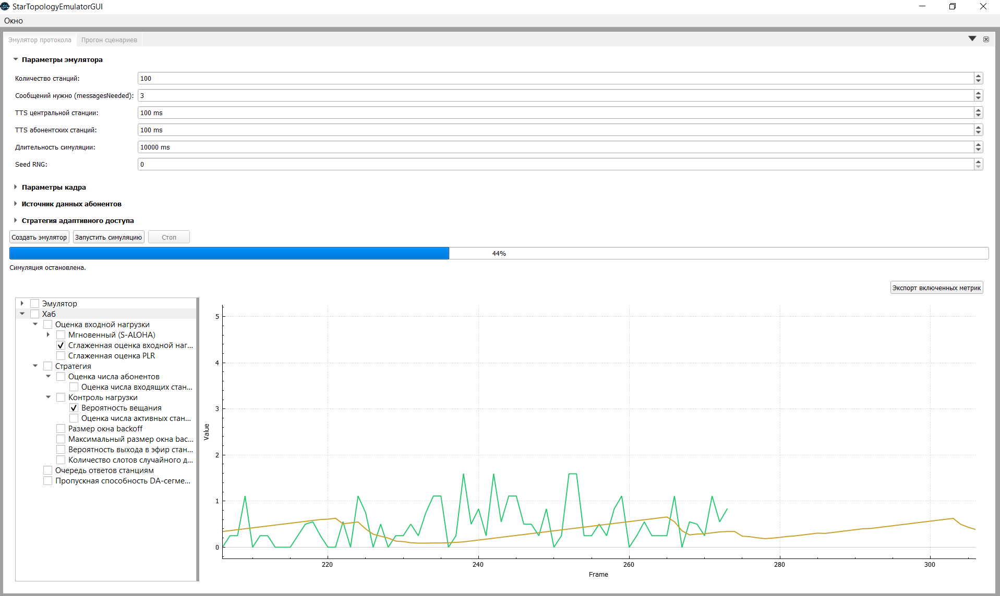
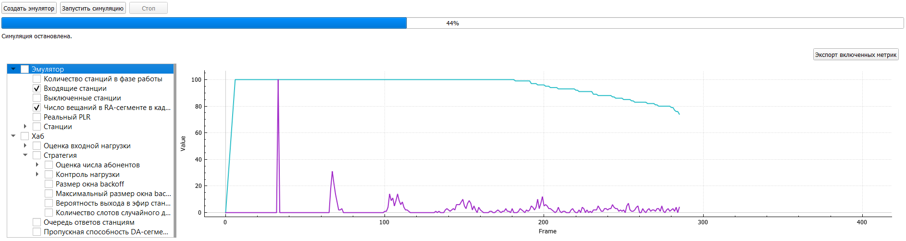
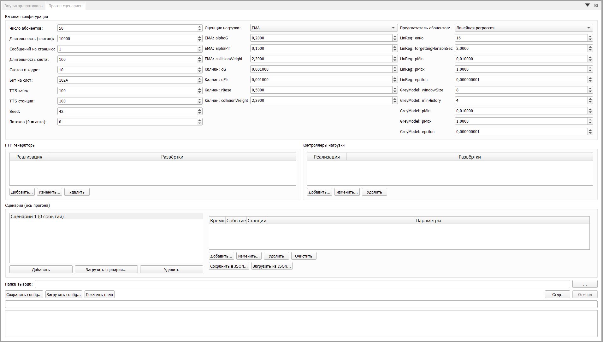
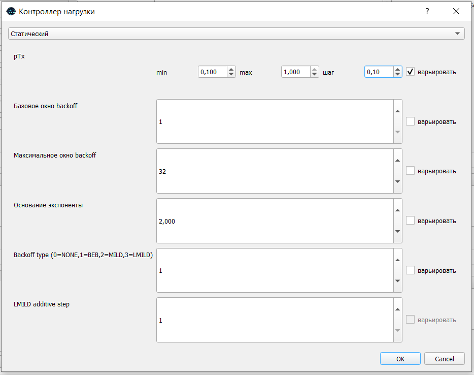
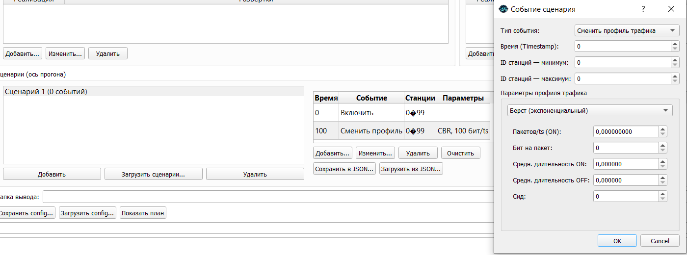

# StarTopologyEmulatorGUI

Графический интерфейс к эмулятору сети звёздной топологии (`StarTopologyEmulator`):
один хаб и множество станций, работающих в TDMA-кадре. GUI позволяет собрать
конфигурацию хаба и станций, запустить моделирование и оценить поведение выбранных
алгоритмов оценки входной нагрузки, предсказания числа абонентов и управления
нагрузкой.

---

## Сборка и зависимости

Требования:

- Компилятор с поддержкой C++23
- CMake ≥ 3.25
- Qt 5

Сборка:

```bash
git submodule update --init --recursive
mkdir _build
cd _build
cmake ../
```

---

## Работа приложения

Окно приложения состоит из двух модулей, переключаемых вкладками/доками:

- **Быстрая проверка** — интерактивный прогон одной конфигурации с живыми графиками;
- **Бенчмарки** — пакетный прогон множества конфигураций со сбором CSV.

### Режим 1. Быстрая проверка с графиками

Интерактивный режим для одного прогона: настраиваете параметры, создаёте эмулятор,
запускаете симуляцию и наблюдаете метрики в реальном времени.


<!-- TODO: скриншот панели «Быстрая проверка» -->

**Что настраивается:**

- **Параметры эмуляции** — число станций, число сообщений на станцию, TTS хаба,
  TTS станции, длительность прогона (в слотах), seed генератора случайных чисел.
- **Параметры кадра** — число слотов в кадре, длительность слота, epoch, бит на слот.
- **Оценка входной нагрузки** — выбор оценщика (EMA или фильтр Калмана) и его параметров.
- **Стратегия хаба** — простая (`Simple`) или составная (`Common`); для составной
  настраиваются FTP-генератор, контроллер нагрузки и предиктор числа абонентов.

**Управление прогоном:**

- **Создать эмулятор** — собирает хаб и станции по текущей конфигурации.
- **Старт / Стоп** — запуск и остановка симуляции; модель продвигается по таймеру
  пачками слотов за тик.
- **Графики** — метрики строятся вживую по кадрам и сгруппированы по областям:
  хаб → стратегия → (оценка входной нагрузки, оценка числа абонентов, контроль нагрузки).



### Режим 2. Бенчмарки

Пакетный режим для сравнения конфигураций. Вы описываете несколько измерений —
оценщик входной нагрузки, предиктор числа абонентов, набор FTP-генераторов и
контроллеров нагрузки, а также сценарии нагрузки. GUI собирает из этих измерений
сетку конфигураций, последовательно (опционально в несколько потоков) прогоняет
все сочетания и сохраняет результаты в CSV для последующего анализа.



**Как собирается сетка.** Каждое измерение даёт свои варианты, а итоговый план — это
все их сочетания. Дополнительно любой числовой параметр реализации можно задать не
одним значением, а диапазоном (развёрткой) — тогда он добавляет в сетку ещё одно
измерение. Перед запуском доступен предпросмотр: сколько всего получилось прогонов и
как выглядят первые из них.



**Сценарии.** Сценарий — это профиль нагрузки во времени (включение/выключение
станций, смена характера трафика). Можно загрузить сразу несколько сценариев и
редактировать их во встроенном редакторе; каждый сценарий становится отдельной осью
прогона, и сетка прогоняется для каждого из них.



**Запуск и результаты.** Конфигурацию бенчмарка можно сохранить и загрузить.
Во время прогона отображаются прогресс и лог; результаты складываются в выбранный
каталог в виде CSV-файлов по прогонам, сводного индекса и снимка конфигурации.